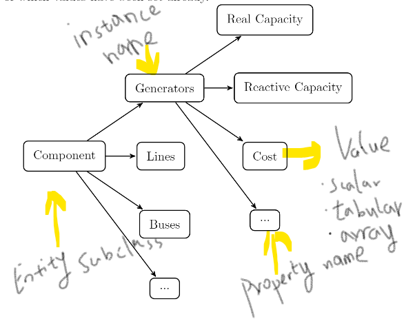

### Practical implementation CESI Model Integration Environment

For details, see notebook funcsClass.ipynb ..

The implementation of the suggested skeleton functions including:

    1. [x] solve()
    2. [x] getSets()
    3. [*] getInput()
    4. [*] getOutput()
    5. [x] getValue()
    6. [*] getDerivative/getSensitivity()
    
    
The schematic illustration of model inherent entities structure can be shown as:

  

